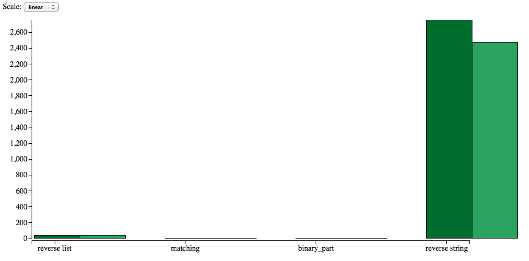

Benchfella
==========

Benchmarking tool for Elixir.


## Installation

You can clone the repository and create tests in the `bench/` directory. Or you
can install an archive locally to make bench tasks available system-wide:

    mix archive.install https://github.com/alco/benchfella/releases/download/archive/benchfella-0.0.2.ez


## Usage

Add a directory called `bench` and put files called `*_bench.exs` into it. Then
run `mix bench`.

Example:

```elixir
defmodule BasicBench do
  use Benchfella

  @list Enum.to_list(1..1000)

  bench "hello list" do
    Enum.reverse @list
  end
end
```


### `mix bench`

Sample output:

```
$ mix bench
Settings:
  duration:      1.0 s
  mem stats:     false
  sys mem stats: false

[02:53:15] 1/4: StringBench.reverse string
[02:53:18] 2/4: BinBench.binary_part
[02:53:19] 3/4: BinBench.matching
[02:53:25] 4/4: ListBench.reverse list
Finished in 12.2 seconds

BinBench.binary_part:        100000000   0.01 µs/op
BinBench.matching:           100000000   0.05 µs/op
ListBench.reverse list:          50000   41.33 µs/op
StringBench.reverse string:       1000   2474.14 µs/op
```


### `mix bench.cmp`

To compare results between multiple runs, use `mix bench.cmp`.

```
$ mix bench -n bench/benchfella/* >snapshot1.txt
Settings:
  duration:      1.0 s
  mem stats:     false
  sys mem stats: false

[02:55:43] 1/3: BinBench.binary_part
[02:55:45] 2/3: BinBench.matching
[02:55:50] 3/3: ListBench.reverse list
Finished in 9.57 seconds

$ mix bench -q -n bench/benchfella/* >snapshot2.txt

$ mix bench.cmp -f percent snapshot1.txt snapshot2.txt
BinBench.matching:      -6.44%
ListBench.reverse list: -1.28%
BinBench.binary_part:   -0.83%
```


### `mix bench.graph`

Benchfella can produce an HTML page with graphs providing various insights into
the raw data obtained from running `mix bench`.

```sh
# run the benchmarks twice
$ mix bench
$ mix bench

# snapshots are automatically saved into bench/snapshots directory, so we can
# omit arguments from bench.graph
$ mix bench.graph
Wrote bench/graphs/index.html
```




## License

This software is licensed under [the MIT license](LICENSE).
